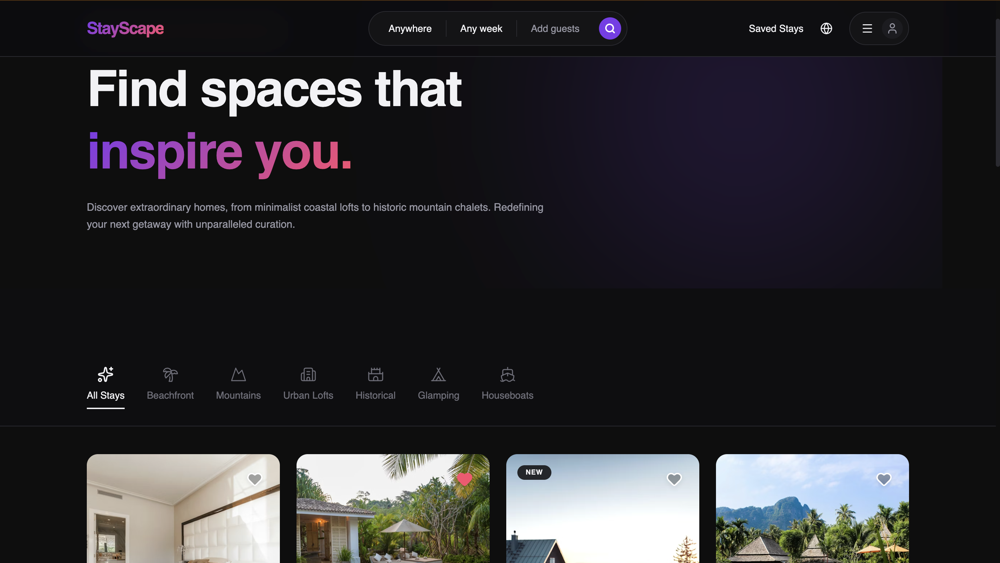

# StayScape 🏠

A production-grade, full-featured property rental platform frontend built with
React, Tailwind CSS v4, and Framer Motion. Designed as a portfolio-defining
project that feels like a real funded startup product — not a basic clone.



---

## ✨ Features

### 🏡 Browse & Discovery
- Full-screen hero section with immersive property imagery
- Responsive listing grid with 8+ curated stays across India
- Horizontal category filter strip (Beachfront, Mountains, City, Cabins, etc.)
- Popular destinations row with circular destination cards
- Wishlist / save functionality with heart toggle animation

### 🔍 Property Detail Page
- Full image gallery (hero + 2×2 grid layout)
- Photo lightbox modal with keyboard navigation (← → Esc)
- Sticky booking widget with live price breakdown calculator
- Host profile card with trust badges
- Amenities grid with hover interactions
- Guest reviews section with rating breakdown bars
- Location section with map placeholder
- Reserve success toast notification with Framer Motion animation

### 🔐 Authentication
- Demo login gate with persistent session via localStorage
- Protected dashboard route
- Navbar avatar dropdown (Dashboard / Bookings / Sign Out)

**Demo Credentials:**
```
Email:    demoaccount@email.com
Password: DemoAccount123
```

### 👤 User Dashboard
- **My Bookings** — mock booking cards with status badges (Confirmed / Completed)
- **Saved Stays** — wishlist of heart-saved properties
- **My Account** — profile info, edit/change password UI, sign out

---

## 🛠 Tech Stack

| Technology | Purpose |
|---|---|
| React 18 + Vite | Frontend framework and build tool |
| Tailwind CSS v4 | Utility-first styling with `@theme` config |
| Framer Motion | Page transitions, card animations, micro-interactions |
| React Router v6 | Client-side routing |
| localStorage | Auth session persistence |

---

## 🎨 Design System

| Token | Value | Usage |
|---|---|---|
| `--bg` | `#0D0D0F` | Page background |
| `--surface` | `#141416` | Cards, panels |
| `--elevated` | `#1C1C20` | Booking widget, modals |
| `--violet` | `#7C3AED` | Primary accent, active states |
| `--coral` | `#FF4D6D` | Price, CTA highlights |
| `--amber` | `#F59E0B` | Star ratings |
| Gradient | `135deg #7C3AED → #FF4D6D` | Buttons, logo, hero text |

**Fonts:**
- `Playfair Display` — Display headings
- `DM Sans` — All UI text
- `JetBrains Mono` — Price values only

---

## 🚀 Getting Started

### Prerequisites
- Node.js 18+
- npm 9+

### Installation
```bash
# Clone the repository
git clone https://github.com/Aryan-Karfa/stayscape.git
cd stayscape

# Install dependencies
npm install

# Install Tailwind v4 PostCSS plugin
npm install -D @tailwindcss/postcss

# Start development server
npm run dev
```

### Build for Production
```bash
npm run build
npm run preview
```

---

## 📁 Project Structure
```
stayscape/
├── public/
├── src/
│   ├── components/
│   │   ├── Navbar.jsx          # Sticky nav with auth-aware avatar dropdown
│   │   ├── ListingCard.jsx     # Reusable property card with hover animation
│   │   ├── CategoryFilter.jsx  # Horizontal scrollable category strip
│   │   ├── BookingWidget.jsx   # Sticky price calculator and reserve button
│   │   ├── ImageGallery.jsx    # Hero + grid gallery with lightbox
│   │   ├── AmenitiesList.jsx   # Icon grid with hover effects
│   │   └── Footer.jsx
│   ├── pages/
│   │   ├── HomePage.jsx        # Discovery feed with hero and listing grid
│   │   ├── ListingDetailPage.jsx # Full property detail with all sections
│   │   ├── LoginPage.jsx       # Demo auth gate
│   │   ├── DashboardPage.jsx   # User area with tabbed navigation
│   │   └── BookingConfirmPage.jsx
│   ├── context/
│   │   └── AuthContext.jsx     # Auth state with localStorage persistence
│   ├── data/
│   │   └── listings.js         # 8 mock property listings across India
│   ├── App.jsx
│   ├── main.jsx
│   └── index.css               # Tailwind v4 @import + @theme tokens
├── index.html
├── vite.config.js
├── postcss.config.js
└── package.json
```

---

## ⚙️ Tailwind CSS v4 Configuration

This project uses **Tailwind CSS v4**. Configuration lives entirely in
`src/index.css` — no `tailwind.config.js` required.
```css
/* src/index.css */
@import "tailwindcss";

@theme {
  --font-family-display: 'Playfair Display', Georgia, serif;
  --font-family-sans: 'DM Sans', system-ui, sans-serif;
  --font-family-mono: 'JetBrains Mono', monospace;
}
```
```js
// postcss.config.js
export default {
  plugins: {
    '@tailwindcss/postcss': {},
  },
}
```

---

## 🗺️ Pages & Routes

| Route | Page | Auth Required |
|---|---|---|
| `/` | Homepage — browse listings | No |
| `/listing/:id` | Property detail page | No |
| `/login` | Demo login page | No |
| `/dashboard` | User dashboard | Yes |
| `/confirm` | Booking confirmation | No |

---

## 🎬 Animations

All animations use **Framer Motion**:

- Page transitions: `opacity 0→1`, `y 20→0`, `duration 0.4s`
- Card entrance: staggered `fadeUp` with `staggerChildren: 0.07s`
- Card hover: `scale(1.02)`, `translateY(-4px)`, spring physics
- Reserve button: `whileHover scale(1.02)`, `whileTap scale(0.98)` + shimmer
- Heart toggle: scale bounce `0 → 1.4 → 1` on click
- Lightbox: slide transition `x: 60→0` on next, `x: -60→0` on previous
- Toast notification: slide down `y: -60→0`, auto-exit after 3 seconds
- Photo lightbox: `AnimatePresence` fade with directional slide

---

## 📍 Mock Listings

All 8 listings feature real Indian destinations:

| Property | Location | Price/night |
|---|---|---|
| Clifftop Villa with Infinity Pool | Goa — Vagator Beach | ₹12,800 |
| Snow-Capped Mountain Retreat | Manali — Old Manali | ₹7,200 |
| Heritage Haveli with Courtyard | Udaipur — Old City | ₹15,400 |
| Rainforest Estate with Plunge Pool | Coorg — Madikeri Hills | ₹9,600 |
| Riverside Glamping Tent | Rishikesh — Tapovan Beach | ₹4,200 |
| Pink City Designer Apartment | Jaipur — Bani Park | ₹5,800 |
| Treehouse in the Cardamom Hills | Ooty — Kotagiri Forest | ₹6,500 |
| Lakeside Cottage with Boathouse | Alleppey — Vembanad Lake | ₹8,900 |

---

## 🧑‍💻 Author

**Aryan Karfa**  
Built with React, Tailwind CSS v4, and Framer Motion.  
Designed as a portfolio project inspired by Airbnb and MakeMyTrip.

---

## 📄 License

This project is open source and available under the [MIT License](LICENSE).

---

> ⭐ If you found this project helpful or impressive, consider giving it a star!
